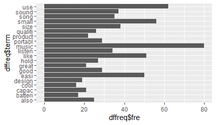
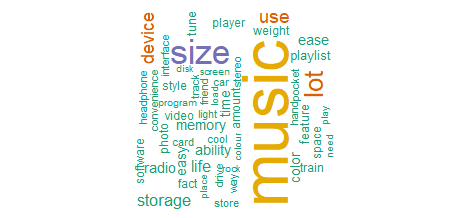

# TopicModellingDTM

In this program Machine Learning is employed in R to perform Topic Modelling. We do an analysis of a survey with 405 documents with 6 survey questions to summarize people are saying about a portable music player in the form of a word cloud. The techniques used include Document-Term Matrix which each row is a document and each column is a term. A very sparse matrix is produced. Punctuation, stopwords and numbers are removed. In the process of normalizing, we use Stemming which helps us achieve the root form of a word, we plot a graph of word frequency with words occurring more than 15 times. A word cloud is generated from the survey.

